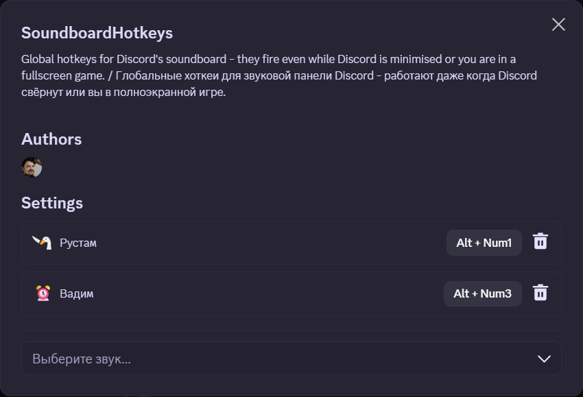
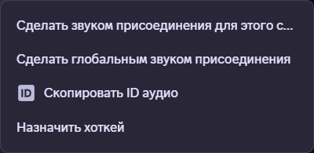

# SoundboardHotkeys

**English** | [Русский](README.ru.md)

[](LICENSE)
[](https://vencord.dev)

A [Vencord](https://vencord.dev) userplugin that binds **global hotkeys** to Discord's
native soundboard.

Press `Alt+Num1` without leaving your fullscreen game — the sound plays into the voice
channel and **everyone hears it**.



## Why

Discord's soundboard only responds to a click in the UI. In the case that actually
matters — you are in a game, Discord is minimised — that means alt-tabbing out to press a
button. This plugin closes that gap.

## Features

- **Truly global hotkeys.** Registered in Electron's main process via `globalShortcut`,
  so they fire while Discord is minimised or a game has focus.
- **Native soundboard.** Plays through Discord's own soundboard, so everyone in the voice
  channel hears it — not just you.
- **Two ways to bind.** Right-click a sound → *Assign hotkey*, or pick it from a
  searchable list in the plugin settings.
- **Record by pressing.** Click the key button, press your combination. Escape cancels.
- **Readable keys.** Shown as `Alt + Num1`, not `Alt+num1`.
- **English and Russian.** Follows your Discord language automatically.
- **Honest failures.** Not in a voice channel, muted, rate-limited, or the combination is
  already owned by another app — each says so instead of failing silently.

## Requirements

| | |
|---|---|
| Discord | **Desktop app.** Global hotkeys cannot exist in a browser |
| [Node.js](https://nodejs.org) | 18 or newer |
| [pnpm](https://pnpm.io) | `npm i -g pnpm` |
| [Git](https://git-scm.com) | any recent version |

## Installation

> **Why is this not just "drop in a file"?**
> Global hotkeys need Electron's `globalShortcut`, which only exists in the main process.
> Vencord reaches it through a plugin's `native.ts`, and that file is **only bundled when
> Vencord is built from source**. A prebuilt Vencord install cannot provide this. That is
> the price of the feature.

### Step 1 — Check your tools

```bash
node --version   # v18.0.0 or higher
pnpm --version   # any version
git --version    # any version
```

If any command is "not found", install it from the table above and reopen your terminal.

### Step 2 — Get the Vencord source

Pick a folder you will keep — you need it again for every update.

```bash
git clone https://github.com/Vendicated/Vencord
cd Vencord
pnpm install --frozen-lockfile
```

The last command downloads dependencies and takes a minute or two.

### Step 3 — Add the plugin

From inside the `Vencord` folder:

```bash
mkdir -p src/userplugins
git clone https://github.com/GriffTanen/vc-soundboard-hotkeys src/userplugins/_shk
mv src/userplugins/_shk/src/soundboardHotkeys src/userplugins/soundboardHotkeys
rm -rf src/userplugins/_shk
```

Verify — the folder must contain exactly these five files:

```bash
ls src/userplugins/soundboardHotkeys
# HotkeyRecorder.tsx  i18n.ts  index.tsx  native.ts  types.ts
```

> Never leave an **empty** folder inside `src/userplugins` — Vencord fails to compile.

### Step 4 — Build

```bash
pnpm build
```

Finishes with a list of generated files. Any error here means Step 3 went wrong.

### Step 5 — Install into Discord

```bash
pnpm inject
```

Choose your Discord installation when asked.

### Step 6 — Restart Discord completely

Closing the window is **not** enough — Discord keeps running in the tray.
Right-click the tray icon → *Quit Discord*, then start it again.

### Step 7 — Enable the plugin

**User Settings → Vencord → Plugins → SoundboardHotkeys** → turn it on.

If it is not in the list, Step 4 or Step 5 did not finish — repeat them.

## Usage

### Bind a hotkey

Two ways, whichever suits you:

- **From the settings window** — open the plugin's cog, pick a sound in *Add a sound*,
  then press the combination you want.
- **From the soundboard** — right-click any sound → **Assign hotkey**, then press the
  combination.



### Play it

Join a voice channel and press the key. It works with Discord minimised, and with a
fullscreen game in focus — that is the whole point.

### Choosing combinations

While Discord runs, a registered combination is **captured system-wide** — other
applications will not receive it. Prefer rare combinations such as `Alt+Num1`, and avoid
anything your game or OS already uses.

Nothing is bound by default, deliberately.

## Updating

From the `Vencord` folder:

```bash
cd src/userplugins/soundboardHotkeys
git pull            # only if you kept it as a git clone
cd ../../..
pnpm build
```

Restart Discord afterwards.

## Uninstalling

```bash
rm -rf src/userplugins/soundboardHotkeys
pnpm build
```

To remove Vencord entirely, run `pnpm uninject`.

## Troubleshooting

| Symptom | Cause |
|---|---|
| Plugin missing from the list | Build or inject did not finish — redo Steps 4–6 |
| Hotkey does nothing | Combination is taken by another app; the plugin says so in a toast. Pick another |
| "Join a voice channel" toast | Soundboard only works inside a voice channel |
| Nothing happens while muted | Discord blocks the soundboard when muted or deafened |
| Works focused, not minimised | Vencord was not built from source — see the note above Step 1 |

## Limitations

Discord's rules, not the plugin's:

- You must be in a voice channel, and not muted, deafened, or suppressed.
- Requires `SPEAK` + `USE_SOUNDBOARD` (and `USE_EXTERNAL_SOUNDS` for sounds from another
  server).
- Roughly a 5-second cooldown between sounds.

Plugin-specific:

- Presses are polled every 100ms, since Vencord gives plugins no way to receive pushed
  IPC events. Expect up to ~100ms of latency.
- Desktop only.

## How it works

Two Electron processes, because neither half can do the job alone:

- **[`native.ts`](src/soundboardHotkeys/native.ts)** (main process) — the only place
  `globalShortcut` exists. Registers combinations and queues presses.
- **[`index.tsx`](src/soundboardHotkeys/index.tsx)** (renderer) — the only place
  Discord's stores and REST client exist. Maps a combination to a sound and plays it.

The renderer drains the main process's queue on a timer, because Vencord exposes only
invoke-style request/response to plugins — main has no channel to push events into the
renderer.

### Playing a sound takes two calls, not one

Worth knowing if you are building something similar, because it is documented nowhere.
Discord's own soundboard button does **two** things:

1. `POST /channels/{id}/send-soundboard-sound` — broadcasts the emoji and tells the
   server;
2. an internal `GUILD_SOUNDBOARD_SOUND_PLAY_LOCALLY` dispatch — **this is what actually
   produces audio**.

With only the POST, the request returns `204`, the emoji appears for everyone, and nobody
hears a thing. The `emoji_id` / `emoji_name` fields are undocumented as required but
behave the same way when omitted.

`204` from that endpoint means "accepted", not "played".

## Development

```bash
npx tsc --noEmit -p tsconfig.json
pnpm build
```

Testing is manual — see [docs/TESTING.md](docs/TESTING.md). Automated tests are not
meaningful here: every API involved only exists inside a running Discord client.

Contributions welcome — see [CONTRIBUTING.md](CONTRIBUTING.md).

## License

[GPL-3.0-or-later](LICENSE), matching Vencord.
